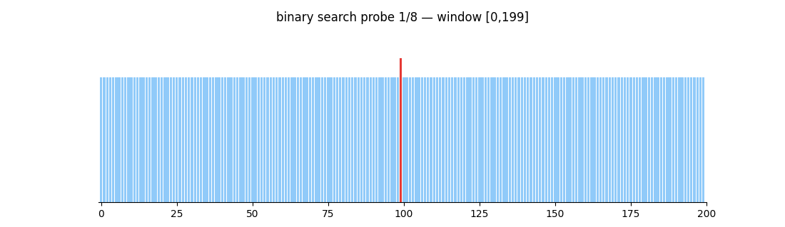

# crux

Finds the commit that changed a program's behavior and shows the lines in that commit that caused the change.



[](https://github.com/Emran-goat/crux/actions)
[](https://crates.io/crates/crux-finder)
[](https://www.npmjs.com/package/crux-finder)
[](LICENSE)

## Description

crux takes a command and a commit range. It runs the command at the first and last commit, and if the results differ it binary searches the commits in between to find where the behavior changed. After the search it splits the flip commit's diff into hunks, applies subsets of them onto the parent commit, and re-runs the command until only the hunks that reproduce the change are left. The output is the commit hash and the minimal diff.

The command is classified by exit code only. Exit 0 means the behavior is unchanged; any other code means it changed. Output text is captured for reports but never parsed, so the command can check anything a script can check: test suites, printed values, file contents, API responses.

The binary is 2.04 MB and needs git on PATH.

## Install

The install script detects the platform, downloads the release binary from GitHub, verifies its sha256 checksum, and installs it to `~/.local/bin`:

```bash
curl -fsSL https://crux.rweb.site/install.sh | bash
```

On Windows the equivalent is a PowerShell script:

```powershell
powershell -ExecutionPolicy Bypass -File install.ps1
```

Package managers also work: `cargo install crux-finder`, `npm i -g crux-finder` (or `npx crux-finder` with no install step), `brew install Emran-goat/crux/crux`, `winget install Emran-goat.crux`, or the Scoop bucket at `https://github.com/Emran-goat/crux`.

## Usage

```bash
crux who -c "cargo test --quiet" -f HEAD~20..HEAD
```

Output:

```text
cmd:   e651ba8cf65a
commit: 7f31ac rework feeder pipeline
suspects: src/config.py, src/feeder.py
essential: 1 of 3 hunks (4 probes)
  -chunks = ids + tail
  +ids = chunks.split()
```

The first line is a fingerprint of the command, used to link runs in the history log. `commit` names the first commit where the command exits nonzero. `suspects` lists every file changed in the range, and `essential` is the minimal diff with the probe count in parentheses.

`--fast` stops after the search. The default run continues with the minimized diff, dependency checks, and ranked candidates for non-monotone history. `--parallel` probes commits across git worktrees concurrently.

## How it works

1. Run the command at the newest and oldest commit in the range. Two runs.
2. Binary search between them: about 8 runs on 100 commits, 11 on 1,000.
3. Split the flip commit's diff into hunks. Apply subsets onto the parent commit and re-run the command until the smallest breaking subset remains.
4. Check for causes a single-commit search misses: pairs of commits that fail only together, dependency version changes, and histories with more than one flip.

All working tree changes are reverted afterward, including after an interrupted run.

## Comparison with git bisect

git bisect need you to manualy classify commits as good or bad and returns the first bad commit. crux accepts the same kind of predicate but adds a minimal diff, detection of two-commit failures, dependency attribution, and a ranked list when no single flip exists.

| | git bisect | crux |
|---|---|---|
| classification | good / bad | any command, by exit code |
| result | first bad commit | commit plus minimal diff |
| two-commit failures | reported as the later commit | both commits named |
| dependency changes | not detected | version transition and upstream commits |
| multiple flips | first flip wins | ranked candidate list |

On the nine scenario benchmark suite (linear histories at 50, 200, and 1,000 commits, a merge, a large diff, an interaction fault, a dependency chain, slow tests, and a real repository), crux with `--fast` had lower wall time than git bisect on 5 of 9 scenarios: 1.183s vs 1.215s on the 200-commit case, 10 timed runs per tool with hyperfine. Both tools named the correct commit on all monotone scenarios. The harness, raw data, and charts are in [benchmark/](benchmark/BENCHMARKING.md).

## Documentation

The full documentation covers every feature, the internals, state files, and troubleshooting: https://crux.rweb.site/docs

## Feedback and support

Bug reports go to the issue tracker; reports with `crux doctor` output attached are easier to act on, since doctor runs four checks and prints one line per check. Pull requests are accepted, and small diffs get reviewed fastest.

Development is funded through tiers on [the website](https://crux.rweb.site/#support).

## License

[MIT](LICENSE)
